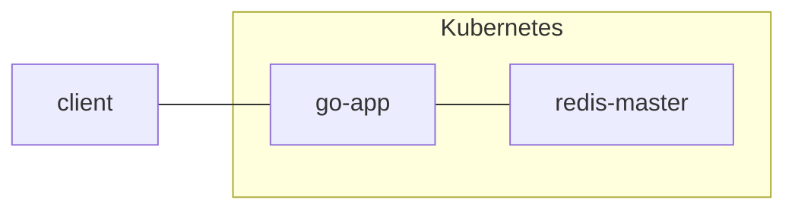

# Kubernetes, Redis and Go

In this simple project we explore Kubernetes solutions with a Go application and a redis backend database.  



# Usage

I host Kubernetes locally with [minikube](https://github.com/kubernetes/minikube). The build process takes advantage of the minikube Docker daemon to build and host container images for Kubernetes to consume.


## Build
```
make build
```

## Deploy
```
make deploy
```

## Forward
To access pods on the minikube node we need to either forward the minikube port to localhost, or ssh into the minikube node to access the pods directly. Forward the webserver port to localhost with:

```
make forward
```

# Examples

## POST
```
➜  curl -X POST -H "Content-Type: application/json" -d '{"Key":"foo", "Value":"bar"}' localhost:8080
Wrote foo:bar to database
```

## GET
```
➜  curl localhost:8080/foo
Getting value of key: foo
Value: bar
```

## Other

Currently only POST and GET calls are supported:

```
➜  curl -X DELETE localhost:8080/foo
404
```

# Blog
Read more on my [blogpost](https://eriksnartland.no/post/2020-12-23-simple-app/).