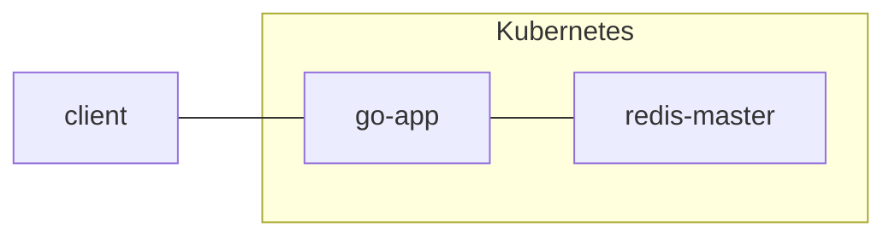

# mermaid

Mermaid is a markdown language to create graphs. GitHub does not support it yet.

```mermaid
flowchart LR
    subgraph Kubernetes
        redis-master
        go-app
    end

    go-app --- redis-master
    client  --- go-app
```